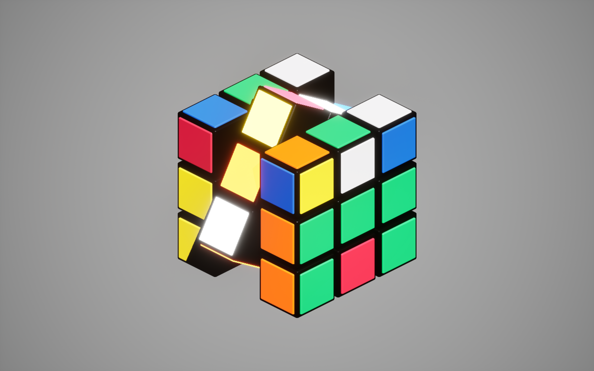
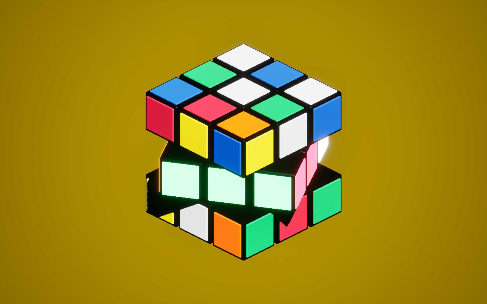

# Unreal Engine Rubik's Cube

A fully functional Rubik's Cube game created in Unreal Engine 5. Nothing special, just a cube with dynamic stylized background.





## Gameplay (Really?)
Click a piece and drag it to move. Hold ```Left Shift``` when clicking to rotate the whole cube.
(Also no exit button for now so press ```Alt+F4``` to exit the game :3) 

